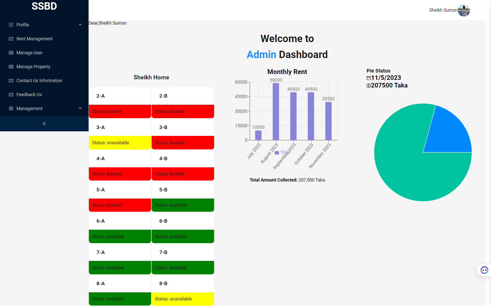

# StaySolutionBD Frontend - Where Elegance Meets Functionality

Welcome to the front end of StaySolutionBD, the comprehensive solution for property rentals that connects tenants with property owners. Our platform provides a seamless user experience, powered by a modern tech stack and best practices in web development. With a focus on user-centric design, we deliver a powerful platform that's as pleasant to use as it is efficient.

# 🌐 Quick Links
- [Live Demo](https://stay-solution-bd-emranswe.vercel.app/)
- [Feature Requests](https://stay-solution-bd-emranswe.vercel.app/contact-us)

## Table of Contents
- [Introduction](#introduction)
- [Aesthetic](#aesthetic)
- [Getting Started](#getting-started)
- [Tech Stack](#tech-stack)
- [Highlighted](#highlighted)
- [Features](#features)
- [Project Structure](#project-structure)
- [Running the Project](#running-the-project)
- [Contributing](#contributing)
- [Credits](#credits)
- [License](#license)

## 🚀 Introduction

StaySolutionBD's frontend is crafted to deliver an intuitive and responsive interface that streamlines the rental process. From property listings and user profiles to booking management and payments, our interface is designed for ease of use and efficiency.

## 🎨 Aesthetic and Responsive Design

Our design philosophy marries aesthetics with functionality. Responsive layouts, seamless transitions, and intuitive navigation form the core of our user interface, offering a consistent experience across all devices - be it a desktop, tablet, or mobile.

- Admin Dashboard

  
## Getting Started

To get started with the development of StaySolutionBD's frontend, you need to have Node.js and npm/yarn installed on your system. Follow the installation instructions below to set up the project on your local machine.In the bustling digital era, StaySolutionBD stands as a beacon of innovation in the property rental landscape. We've sculpted a frontend that not only meets the demands of today's users but anticipates the needs of tomorrow. Dive into an interface where every click brings satisfaction, and every view is a vista of possibility.

## 📚 Tech Stack Enlightenment

- **Next.js**: Our React framework for server-side rendering, SEO-friendliness, and easy routing.
- **TypeScript**: Ensures type safety and improves developer experience with static type checking.
- **Ant Design**: Provides a vast library of high-quality React components for building a rich UI.
- **Redux**: Manages the state of our application, making it predictable and easily manageable.
- **Axios**: Handles HTTP requests with ease, offering a clean and powerful way to communicate with our backend.
- **React Hook Form with Yup**: Manages form state and validation, providing a performant user input experience.
- **Slick Carousel**: Enables the creation of beautiful, responsive carousels to showcase property images.
- **React Spinners**: Offers delightful loading animations, enhancing the perceived performance.
- **Recharts**: Used to display analytics and data visualizations in an accessible and interactive format.

## 🌟 Highlighted Features

- User authentication and profile management.
- Property browsing with advanced search and filtering.
- Property listings with detailed views and image galleries.
- Booking system with calendar integration.
- Secure payment processing interface.
- Responsive design for mobile and tablet compatibility.
- User dashboard for managing listings, bookings, and payments.

## Project Structure

The project is structured into various directories:
- `app/`: main app components.
- `pages/`: Page components that correspond to a route.
- `components/`: Reusable UI components.
- `public/`: Static assets like images and fonts.
- `styles/`: Global styles and CSS/SCSS modules.
- `store/`: Redux store configuration, actions, and reducers.
- `hooks/`: Custom React hooks.

Our Structure Codex elucidates the roles and responsibilities of each segment.
## Running the Project

# Clone the repository
git [clone](https://github.com/YourUsername/staysolutionbd-frontend.git) 

# Navigate to the project directory
cd staysolutionbd-frontend

# Install dependencies
npm install

# Run the development server
npm run dev

## 📜 The Scroll of Licensing
StaySolutionBD's frontend is disseminated with the MIT license, a testament to our belief in the open-source odyssey.

Embark on the full StaySolutionBD journey with us. Together, let's chart a course to the zenith of property rental services.

